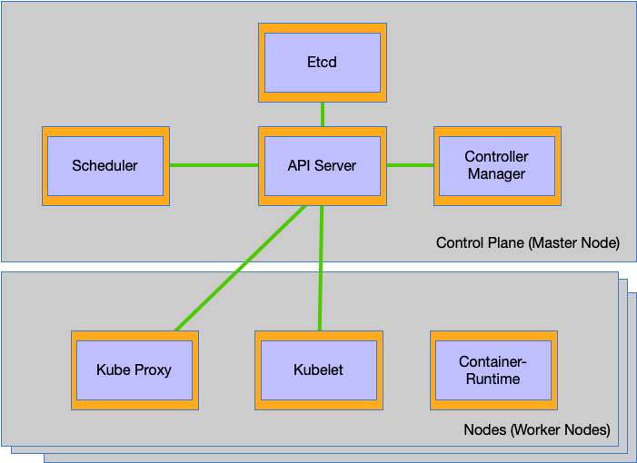

# How Kubernetes Works

## Components of the Control Pane

* The etcd distributed persistent storage
* The API server
* The Scheduler
* The Controller Manager

## Components on the Worker Nodes

* The Kubelet
* The Kubernetes Service Proxy (kube-proxy)
* The Container Runtime (Docker, rkt, or others)

## Additional Components

* The Kubernetes DNS server
* The Dashboard
* An Ingress controller
* Heapster, which we’ll talk about in chapter 14
* The Container Network Interface network plugin (we’ll explain it later in this chapter)

## Distributed Layout of Components



## Checking the status of the Control Plane Components

The following shows the status of each Control Plane Component

```sh
$ kubectl get componentstatuses
NAME                 STATUS    MESSAGE              ERROR
scheduler            Healthy   ok
controller-manager   Healthy   ok
etcd-0               Healthy   {"health": "true"}
```

